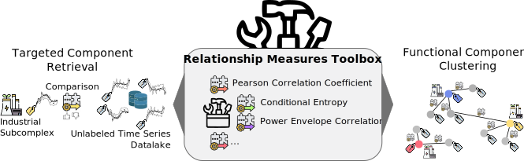

# Overview
This repository contains the code to reproduce the experiments from the paper
"Relationship Discovery for Heterogeneous Time Series Integration: A Comparative Analysis for Industrial and 
Building Data" published at the [BTW2025](https://btw2025.gi.de/).

Not all used datasets are publicly available, but the building datasets can be accessed:
- [KETI](https://www.kaggle.com/datasets/ranakrc/smart-building-system) or [here](https://github.com/MingzheWu418/Joint-Training)
- [SODA](https://github.com/MingzheWu418/Joint-Training/tree/main/colocation/rawdata/metadata/Soda)

Computing the relationship measures can be reproduced by installing python and the necessary dependencies
listed in the `requirements.txt` and then execute `parallelSPI.py` with the corresponding
parameters in a shell.

----
# Reproducibility

## Precomputed relationship measures
Computing over 200 relationship measures for every of the seven datasets is the main computational bottleneck. Even when
distributing the computations on a capable compute server, the results take days to complete. Using the precomputed
relationship measures and computing the metrics takes around ten minutes. One can parallelize this, but we decided to
keep it sequential to keep the reproducibility as easy as possible.

Therefore, we provide the [precalculated similarity/distance matrices](./measurements) within this repository. Computing the relationship
measures uses [available](https://github.com/DynamicsAndNeuralSystems/pyspi) and
[published](https://arxiv.org/abs/2201.11941) Code, therefore, this step is not part of the reproducibility guide. For
the publicly available datasets, one can run `parallelSPI.py` as described above.

## Containerized Reproduction

We provide a [dockerfile](./Dockerfile) and accompanying [docker compose file](./compose.yaml) to reproduce our
evaluation.

Take the following steps to recreate the results
1. Install [docker](https://docs.docker.com/get-started/get-docker/) on your system
2. Clone this repository
3. Navigate to the repository folder within a console
4. [Skip this step if precomputed metrics are okay] Run the evaluation by `docker compose up metrics` (or `docker compose run metrics` - takes around 10-15 min. to complete)
5. Start the jupyther server with `docker compose up notebook` (or `docker compose run notebook`)
6. Click the link printed in the output (that starts with http://127.0.0.1:8081/tree and contains the access token)
7. Navigate to the notebook named [plots_results_paper.ipynb](./plots_results_paper.ipynb)
8. Run the notebook

On linux distributions you may need to prepend `sudo` to all commands, e.g. `sudo docker compose run metrics` 
(as docker requires root).

## Manual Reproduction
In order to reproduce the results of our paper without docker, take the following steps:
1. Clone this repository.
2. Navigate to the repository folder within a console
3. Install the necessary requirements using the `requirements.txt`
4. Run `python evaluateSPI.py` and `python fuseSPI.py` to compute the evaluation metrics (paper: section 3.3) and produce the ranking of the relationship measures (paper: section 3.4)
5. Using the jupyther notebook [plots_results_paper.ipynb](./plots_results_paper.ipynb) you can then reproduce all plots of the paper
6. Run `python absoluteResultsTable.py` to create the .tex file for table 6 in the paper

This repository also already contains the intermediate results from step three. Therefore, you could start at step four
right away after cloning the repository.

## Timing measurements
Our reviewers legitimately asked for timing measurements for each of the relationship measures. We did not provide these
within the paper due to the following reason:
> The implementation of the different relationship measures is not optimized (some even call external java and 
> octave code). Therefore, we did not want to compare the relationship measures on their evaluation times.

But we measured the execution times during our experiments see the interest in analyzing them. We publish them in
this repository using the notebook [analyze_timings.ipynb](./analyze_timings.ipynb). We advise for careful
interpretation of the timings. The notebook can also be run using our provided notebook docker container as explained
before.

----
# Contact
Find our contact information [here](https://www.cs6.tf.fau.eu/person/lucas-weber/).